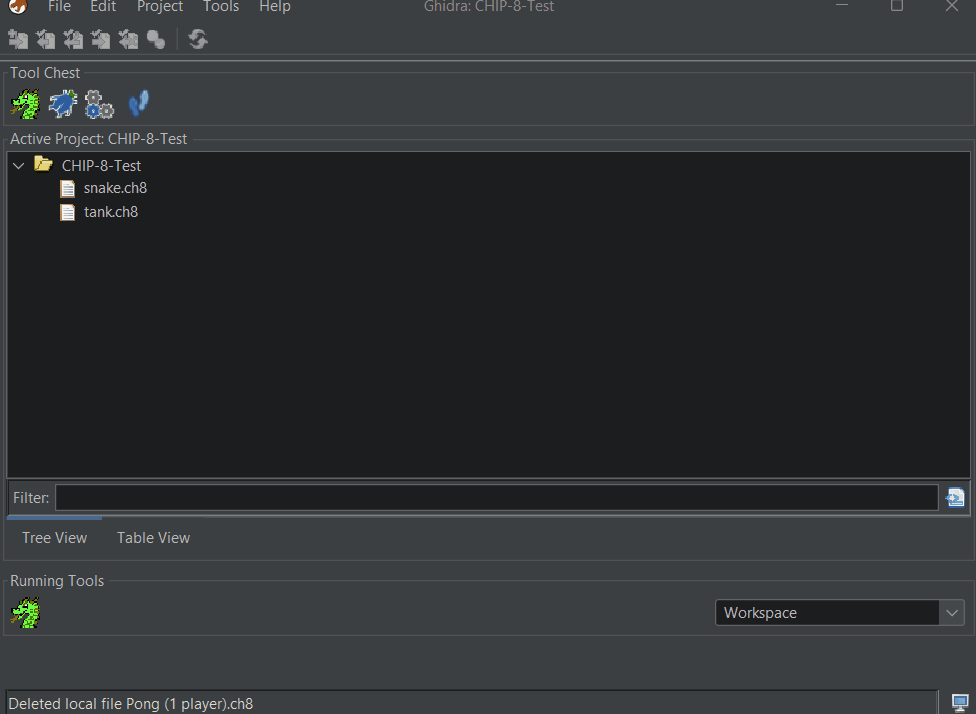
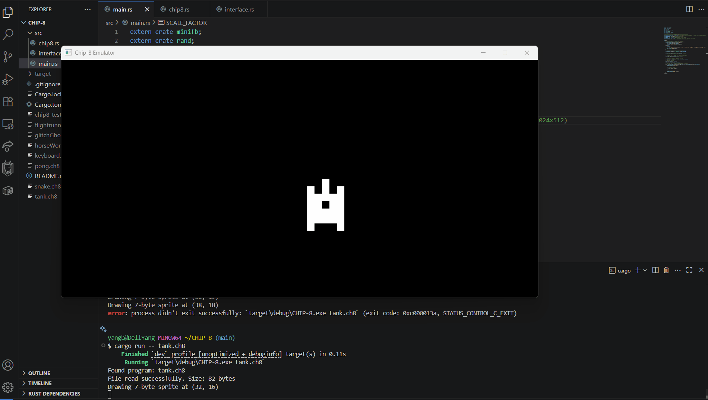
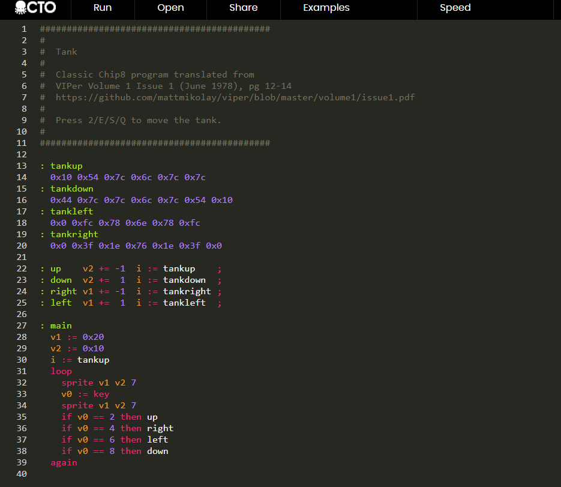
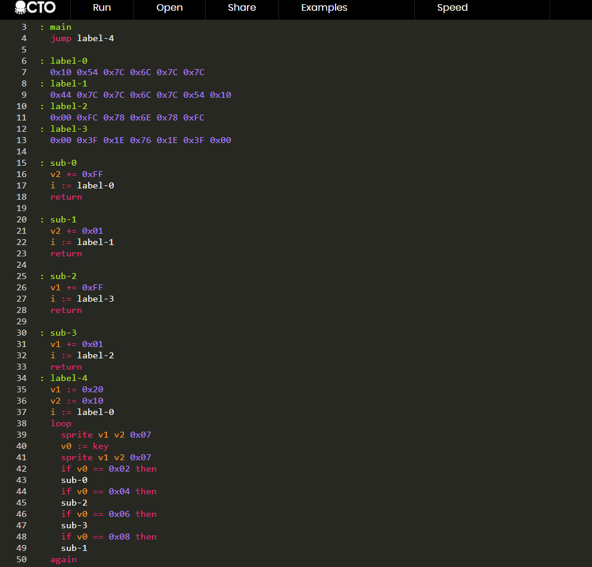
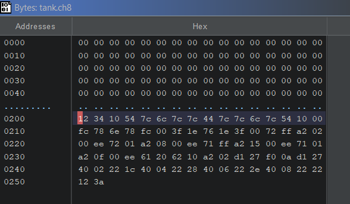
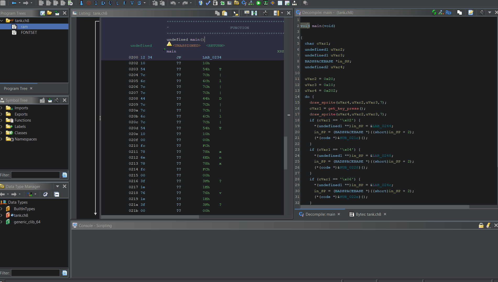
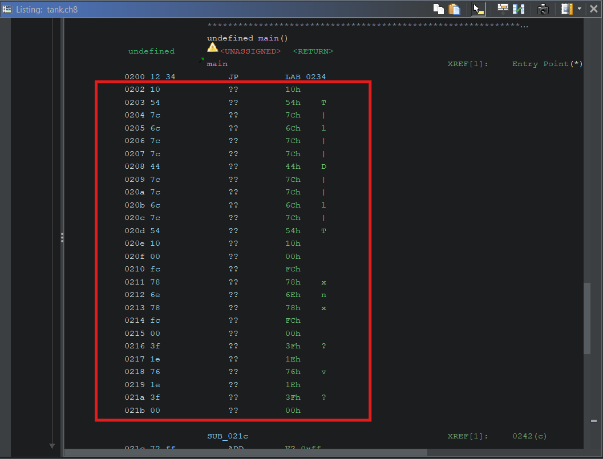
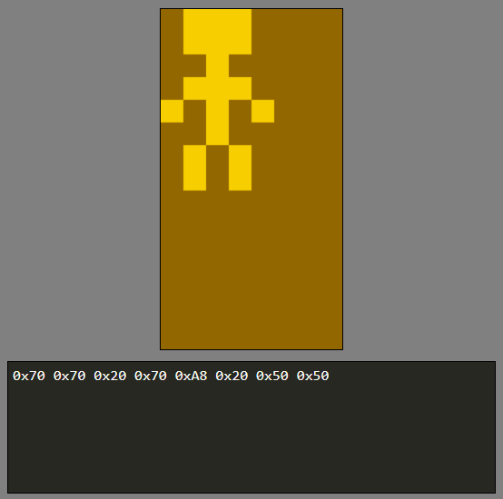
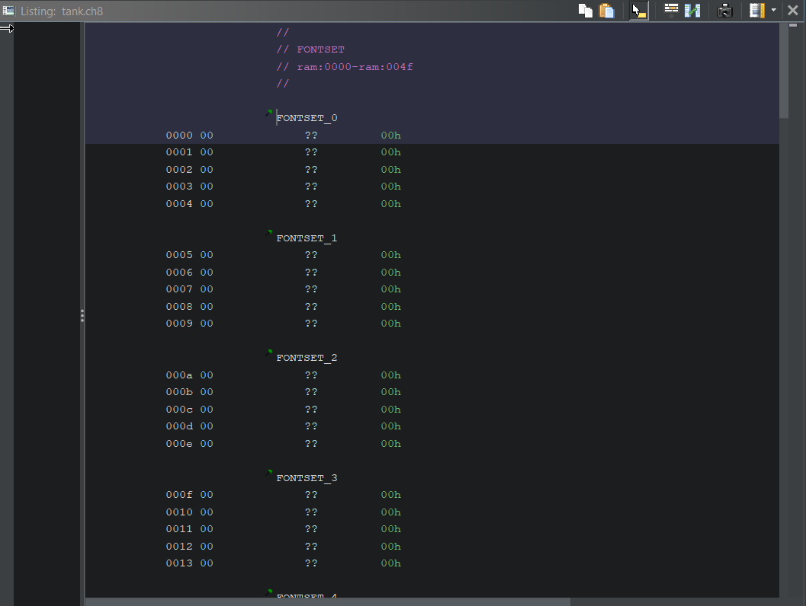

# Additional Functionality

Trying to figure out how to add further functionality to my Ghidra processor; namely:
1. automatically set base address to `0x200` when importing `.ch8` file
2. be able to detect sprites in memory (currently just looks like bytes)
3. be able to automatically load the FONTSET into the memory at `0x000` to `0x050`

## 1. Base address issue
CHIP-8 programs/interpreters expect the base address of program ROM files (`.ch8`) to be at `0x200`; this is listed in the specification.

This is important because CHIP-8 programs use hard-coded jumps (no relative addressing).

In order for this to work in Ghidra, I currently need to manually specify the offset during the import process:



This is sort of a small thing, but I want to know if there is a way to do this automatically when selecting the processor; if I need to create an additional script then I can, just not sure what is/isn't possible right now.

## 2. Detecting sprites in memory
For #2; This might be a little more involved, but I'm hoping this is also doable with some sort of additional scripting functionality I can design in Ghidra.

For more context, CHIP-8 programs don't really have "source" code, but there is an assembler called "Octo" that represents the CHIP-8 instructions in a slightly more compact format. (see Octo here: https://johnearnest.github.io/Octo/)

For example, this is a program called "tank" that simply moves around a sprite:

In my CHIP-8 Emulator:



Octo code:



Octo also has a "decompiler", which gives a better representation of how the program actually looks in the ROM:



Raw bytes: 



And then finally, with my Ghidra processor:



Looking at what I currently see in Ghidra, a major thing I want to be able to detect are sprites, which are essentially just a string of bytes in the ROM that are given meaning by the `DRW` (a.k.a. draw sprite) instruction;

Currently mine just shows a long string of uncast bytes in the disassembly view:



I want to be able to have my processor be able to detect these bytes as sprites.

### More Context: CHIP-8 Sprites
To give some more context about how sprites work in CHIP-8; they are essentially just a string of bytes in the ROM that are given meaning by the `DRW` (a.k.a. draw sprite) instruction.

According to the spec: 
```
"Chip-8 draws graphics on screen through the use of sprites. A sprite is a group of bytes which are a binary representation of the desired picture. Chip-8 sprites may be up to 15 bytes, for a possible sprite size of 8x15."
```

For example, in Octo, a sprite might look like:
```
: person
  0x70 0x70 0x20 0x70 0xA8 0x20 0x50 0x50
```

Breaking it down, essentially each byte is a "row" of the sprite:
- Each `1` represents a pixel that is colored
- Each `0` represents a pixel that is not colored

So for the person sprite:

| Hexadecimal | Binary     | Visual Representation |
| ----------- | ---------- | --------------------- |
| `0x70`      | `01110000` | `###`                 |
| `0x70`      | `01110000` | `###`                 |
| `0x20`      | `00100000` | `#`                   |
| `0x70`      | `01110000` | `###`                 |
| `0xA8`      | `10101000` | `# # #`               |
| `0x20`      | `00100000` | `#`                   |
| `0x50`      | `01010000` | `# #`                 |
| `0x50`      | `01010000` | `# #`                 |

When these rows are displayed together, they form the image of a small person or stick figure:
```
 ###    
 ###    
  #     
 ###    
# # #   
  #     
 # #    
 # #    
```

(Octo also has a sprite tool; good visualization here)



The `DRW` instruction works as follows:

"""

**D*xyn* - DRW V*x*, V*y*, *nibble***
Display *n*-byte sprite starting at memory location `I` at (V*x*, V*y*).  

The interpreter reads *n* bytes from memory, starting at the address stored in `I`. These bytes are then displayed as sprites on screen at coordinates (V*x*, V*y*). 

"""

(Can read the full spec here: http://devernay.free.fr/hacks/chip8/C8TECH10.HTM#Dxyn)


So, I want to be able to have these byte strings get detected as "sprites" in memory; again, not sure if this is possible.

## 3. Automatically load the FONTSET into memory
The CHIP-8 specification states that there is `"a group of sprites representing the hexadecimal digits 0 through F"` that `"should be stored in the interpreter area of Chip-8 memory (0x000 to 0x1FF)"`;

In other words, the first `0x50` bytes (from `0x000` to `0x050`) should always be the same in memory. I already have marked these "font set" sprites as existing in my `.pspec` file, and they show up with labels in Ghidra (but as `0x00` bytes):



I want to know if there's a way to hard-code the values of these first 80 bytes so that they don't show as `0x00`; but I am not sure if this is possible, and also if these really makes sense to do;

Questions/concerns:
- Since Ghidra is a static analysis tool and this is information outside of the specific program file itself, does it make sense to do this at all?  
- i.e. is hard-coding memory that is assumed to be used by the interpreter something that should be done in Ghidra? Or is this closer to the realm of dynamic analysis (and out of scope)?
