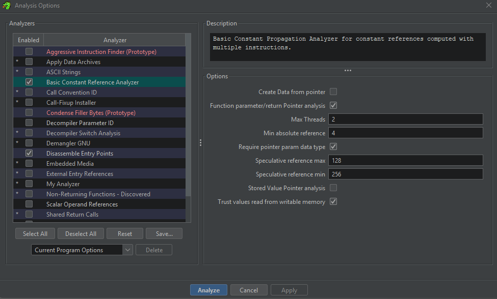

After designing our custom loader, we now only have 1 main issue remaining for our Ghidra module project;
1. being able to detect sprites in memory

For this, I actually went ahead and created a Jython script (first time writing Jython) that performs exactly what I want; 

If I'm not mistaken, it's possible to simply convert this logic into Java and put it in Analyzer part of the Ghidra module. (If not, I guess I'll just leave it as a standalone script? but that's kind scuffed; I'd rather have it as one of the "Auto-Analysis" options)

Essentially the logic for sprite detection is as follows:
1. Find all `DRW` instructions
2. Analyze the possible addresses that sprites could be at (located in the `I` register) by checking all `LD I` instructions
3. Try to create sprites at each potential `I` location using saved dimensions from step 1, checking for if code/instructions currently exist at that location or if the region is NULL or 0x00 bytes (`I` is also used for storing/loading memory, but those regions should only have values at runtime, so assume they are NULL in the ROM, if they are even located in the ROM)

(not 100% sure this is foolproof, but it seems to work on my one test program, which is enough right? lol)

For more context, a Ghidra analyzer is like one of the options that show up when after you import a file, Ghidra asks "do you want to auto-analyze" (or something like that), or if you go to `Analysis` > `Auto-Analyze [current file]`

When opening up `.ch8` ROMs with my Ghidra module, in order for instructions to display in the Listing view (i.e. disassembly), I found that I need to use some of the analyzers that Ghidra provides by default in order for bytes to be shown as instructions; namely:
- "Disassemble Entry Points" ([EntryPointAnalyzer.java](https://github.com/NationalSecurityAgency/ghidra/blob/master/Ghidra/Features/Base/src/main/java/ghidra/app/plugin/core/disassembler/EntryPointAnalyzer.java))
- "Basic Constant Reference Analyzer" ([ConstantPropagationAnalyzer.java](https://github.com/NationalSecurityAgency/ghidra/blob/master/Ghidra/Features/Base/src/main/java/ghidra/app/plugin/core/analysis/ConstantPropagationAnalyzer.java))



Although my focus for now is creating a custom one (in the above image, it currently is just called "My Analyzer"), I think something that would be cool to do eventually is looking into if I could do literally all necessary operations within the one analyzer that I make; i.e. replicate the functionality of the two I know are necessary (mostly for learning purposes)

For now though, I guess I'll focus on getting just the sprite functionality into the analyzer;

## Ghidra Analyzer Layout
Similar to the Loader, all Ghidra analyzers extend an abstract class (`AbstractAnalyzer`) that defines its behavior.

Basic layout:
- constructor: any initial setup, like a normal Java class
- `getDefaultEnablement()`: return true if we want enabled by default; otherwise false
- `canAnalyze()`: supposed to examine the passed in `program` to determine if the analyzer should be able to analyze it
- `registerOptions()`: for any custom options (i.e. in the GUI, some analyzers allow you to specify things like intensity levels or other options for analysis)
- `added()`: essentially the meat of the analyzer; "Perform analysis when things get added to the 'program'. Return true if the analysis succeeded"

Essentially we've got a bunch of settings, and then majority of the logic should go into the `added()` method.

## Step 1: Find all `DRW` instructions
The main way this analyzer works is by examining the `DRW` (draw) instructions, which display sprites on the screen.

The main pieces of info from the draw instructions are:
- the last nibble (`n`), which describes the length/height of the sprite (number of bytes),
- the address in the `I` register at the time of calling the instruction (but we have no way of determining this from a static analysis standpoint, so really just the above; we deal with `I` in the next step)

But first, before we decode anything, we simply want to get the `DRW` instructions;

For this step, in `added()`:
```java
@Override
public boolean added(Program program, AddressSetView set, TaskMonitor monitor, MessageLog log) throws CancelledException {
	
	System.out.println("Starting CHIP-8 Sprite Detection...");
	
	// Step 1: Find all DRW instructions
	findDrwInstructions(program, monitor, log);
	System.out.println("DRW instructions found: " + drwInstructions.size());
	
	... 
	
	System.out.println("Sprite detection complete.");
	return true;
}

private void findDrwInstructions(Program program, TaskMonitor monitor, MessageLog log) throws CancelledException {

	drwInstructions.clear();
	Listing listing = program.getListing();
	InstructionIterator instrIter = listing.getInstructions(true);
	
	while (instrIter.hasNext() && !monitor.isCancelled()) {
		Instruction instruction = instrIter.next();
		if (isDrwInstruction(instruction)) {
			drwInstructions.add(instruction);
			System.out.println("Found DRW at: " + instruction.getAddress());
		}
	}
}
```

We define a function to essentially go through the listing (disassembly) and check if each instruction is a `DRW` instruction. If it is, then we add it to an ArrayList that we keep track of.

The way we check if something is a `DRW` instruction is the same way we check in our emulator, in our processor, and everywhere else; check if the most significant nibble is `0xD`:
```java
private boolean isDrwInstruction(Instruction instruction) {
	if (instruction == null) return false;
	
	try {
		byte[] bytes = instruction.getBytes();
		if (bytes.length >= 2) {
			int firstByte = bytes[0] & 0xFF;
			return (firstByte & 0xF0) == 0xD0;
		}
	} catch (Exception e) {
		// Ignore exceptions
	}
	return false;
}
```

The result of this step is saving the raw bytes of each `DRW` instruction for later use.

## Step 2: Analyze possible `I` register values for sprites
Next, we want to look at what the possible values of the `I` register at the time of `DRW` instructions could be.

For our purposes, we assume that whenever a sprite is put on the screen, there's a corresponding `LD I` instruction for every `DRW` instruction; I think there are technically other ways to get an address into the `I` register, but to keep things simple, I assume that the ROM will always use the `LD I` instruction to load a sprite (I haven't seen otherwise so far)

In `added()`:
```java
@Override
public boolean added(Program program, AddressSetView set, TaskMonitor monitor, MessageLog log) throws CancelledException {
	
	System.out.println("Starting CHIP-8 Sprite Detection...");
	
	// Step 1: Find all DRW instructions
	...
	
	// Step 2: Analyze possible I register values for each DRW
	getPotentialSpriteAddresses(program, log);
	
	...
	
	System.out.println("Sprite detection complete.");
	return true;
}

private void getPotentialSpriteAddresses(Program program, MessageLog log) {
	potentialSpriteAddresses.clear();
	
	for (Instruction drwInstruction : drwInstructions) {
		System.out.println("Analyzing DRW at: " + drwInstruction.getAddress());
		
		int spriteHeight = getSpriteHeight(drwInstruction);
		Set<Long> iValues = findIRegisterValues(program, log);
		
		String drwAddr = drwInstruction.getAddress().toString();
		potentialSpriteAddresses.put(drwAddr, new SpriteInfo(spriteHeight, iValues));
	}
}
```

Once again, we make an iterable data structure to keep track of all possible `I` values, or potential sprite addresses (`potentialSpriteAddresses`); this time a `Map<String, SpriteInfo>`;

We define `SpriteInfo` as a very simple data type:
```java
// Helper class to store sprite information
private static class SpriteInfo {
	private final int spriteHeight;
	private final Set<Long> possibleIValues;
	
	public SpriteInfo(int spriteHeight, Set<Long> possibleIValues) {
		this.spriteHeight = spriteHeight;
		this.possibleIValues = possibleIValues;
	}
	
	public int getSpriteHeight() {
		return spriteHeight;
	}
	
	public Set<Long> getPossibleIValues() {
		return possibleIValues;
	}
}
```

And then we get the height, or size, of the sprite by looking at the last nibble:
```java
private int getSpriteHeight(Instruction drwInstruction) {
	try {
		byte[] bytes = drwInstruction.getBytes();
		if (bytes.length >= 2) {
			return bytes[1] & 0x0F; // Height is the last nibble (n in Dxyn)
		}
	} catch (Exception e) {
		// Ignore exceptions
	}
	return 1;
}
```

As well as the possible `I` values for said sprite:
```java
private Set<Long> findIRegisterValues(Program program, MessageLog log) {
	Set<Long> iAddresses = new HashSet<>();
	Listing listing = program.getListing();
	InstructionIterator instrIter = listing.getInstructions(true);
	
	while (instrIter.hasNext()) {
		Instruction instruction = instrIter.next();
		if (isLoadIInstruction(instruction)) {
			Long addrValue = getLoadIAddress(instruction);
			if (addrValue != null) {
				iAddresses.add(addrValue);
				System.out.println(String.format("\tFound LD I, 0x%03X at %s", 
					addrValue, instruction.getAddress()));
			}
		}
	}
	return iAddresses;
}
```

which essentially involves parsing each instruction to check if they are an `LD I` instruction (separated the logic into additional helper functions):
```java
private boolean isLoadIInstruction(Instruction instruction) {
	try {
		byte[] bytes = instruction.getBytes();
		if (bytes.length >= 2) {
			int firstByte = bytes[0] & 0xFF;
			return (firstByte & 0xF0) == 0xA0; // A in first nibble
		}
	} catch (Exception e) {
		// Ignore exceptions
	}
	return false;
}

private Long getLoadIAddress(Instruction instruction) {
	try {
		byte[] bytes = instruction.getBytes();
		if (bytes.length >= 2) {
			// Address is the last 12 bits (nnn in Annn)
			long addr = ((bytes[0] & 0x0F) << 8) | (bytes[1] & 0xFF);
			return addr;
		}
	} catch (Exception e) {
		// Ignore exceptions
	}
	return null;
}
```

As a result of this step, we have a `Map<String, SpriteInfo>` that keeps track of potential sprites that each `DRW` instruction could refer to.

## Step 3: Try to create sprites at each potential `I` location
Then finally, we want to try and interpret the bytes pointed to by `I` as a sprite.

The main checks I am doing to make sure we aren't creating sprites at random locations (where they don't exist) are:
1. checking for if code/instructions currently exist at that location or
2. if the region is NULL or 0x00 bytes (because `I` is also used for storing/loading memory, but those regions should only have values at runtime)
3. and also whether or not the sprite data is located in the memory (if it fails to read the bytes from the memory, then it isn't in the ROM file and therefore cannot be a sprite)

Relevant main logic in `added()`:
```java
@Override
public boolean added(Program program, AddressSetView set, TaskMonitor monitor, MessageLog log) throws CancelledException {
	
	System.out.println("Starting CHIP-8 Sprite Detection...");
	
	// Step 1: Find all DRW instructions
	...
	
	// Step 2: Analyze possible I register values for each DRW
	...
	
	// Step 3: Create sprite data structures
	createSpriteDataStructures(program, log);
	
	System.out.println("Sprite detection complete.");
	return true;
}

private void createSpriteDataStructures(Program program, MessageLog log) {
	for (Map.Entry<String, SpriteInfo> entry : potentialSpriteAddresses.entrySet()) {
		SpriteInfo info = entry.getValue();
		int spriteHeight = info.getSpriteHeight();
		Set<Long> possibleAddresses = info.getPossibleIValues();
		
		for (Long spriteAddr : possibleAddresses) {
			if (!analyzedAddresses.contains(spriteAddr)) {
				analyzeAndCreateSprite(program, spriteAddr, spriteHeight, log);
			}
		}
	}
}
```

We essentially loop through each potential sprite address, and try to interpret those bytes as a sprite;

3 checks mentioned earlier:
1. if the region is NULL or 0x00 bytes (because `I` is also used for storing/loading memory, but those regions should only have values at runtime) and
2. whether or not in the correct memory region and
3. checking for if code/instructions currently exist at that location
```java
private boolean isValidSpriteData(Program program, List<Integer> spriteData, Address addrObj, int height, MessageLog log) {
	if (spriteData == null || spriteData.isEmpty()) {
		return false;
	}
	
	// Check if region is all zeros (no sprite data)
	if (spriteData.stream().allMatch(b -> b == 0)) {
		return false;
	}
	
	// Check if any of the sprite bytes are already instructions
	Listing listing = program.getListing();
	for (int i = 0; i < height; i++) {
		Address checkAddr = addrObj.add(i);
		Instruction existingInstruction = listing.getInstructionAt(checkAddr);
		if (existingInstruction != null) {
			System.out.println(String.format("Skipping sprite at 0x%03X - contains instruction at 0x%03X",
				addrObj.getOffset(), checkAddr.getOffset()));
			return false;
		}
	}
	return true;
}
```

TODO: logic flaw; I currently parse sprites based on the size of the last DRW instruction; I want to instead find the best fit for any given supposed sprite, which I think we can do by checking number of null bytes in the resulting parsed sprite (less null bytes = better fit)

also instead of `drwInstructions` + `potentialSpriteAddresses` + `analyzedAddresses`

I think it might be better to do something like `candidateSpriteAddresses` + `candidateSpriteLengths` + `bestFitSprites`; I think logically that follows better naming-wise (also less hassle probably when coding)

