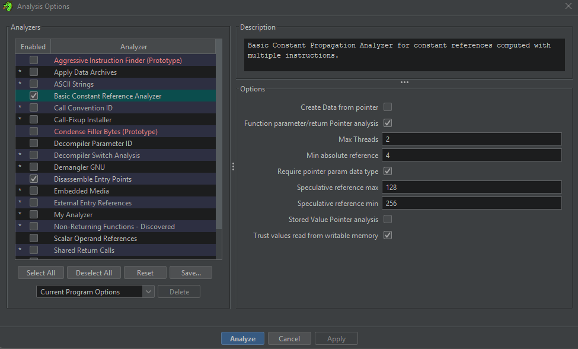

# Ghidra Analyzer Design Notes

After designing our custom loader, we now only have 1 main issue remaining for our Ghidra module project;
1. being able to detect sprites in memory

For this, I actually created a Jython script (first time writing Jython), but later found out that I can implement the logic of the Jython script into a Ghidra analyzer.

## Ghidra Analyzers
For more context, a Ghidra analyzer is like one of the options that show up when after you import a file, Ghidra asks "do you want to auto-analyze" (or something like that), or if you go to `Analysis` > `Auto-Analyze [current file]`

When opening up `.ch8` ROMs with my Ghidra module, in order for instructions to display in the Listing view (i.e. disassembly), I found that I need to use some of the analyzers that Ghidra provides by default in order for bytes to be shown as instructions; namely:
- "Disassemble Entry Points" ([EntryPointAnalyzer.java](https://github.com/NationalSecurityAgency/ghidra/blob/master/Ghidra/Features/Base/src/main/java/ghidra/app/plugin/core/disassembler/EntryPointAnalyzer.java))
- "Basic Constant Reference Analyzer" ([ConstantPropagationAnalyzer.java](https://github.com/NationalSecurityAgency/ghidra/blob/master/Ghidra/Features/Base/src/main/java/ghidra/app/plugin/core/analysis/ConstantPropagationAnalyzer.java))



Although my focus for now is creating a custom one (in the above image, it currently is just called "My Analyzer"), I think something that would be cool to do eventually is looking into if I could do literally all necessary operations within the one analyzer that I make; i.e. replicate the functionality of the two I know are necessary (mostly for learning purposes)

For now though, I guess I'll focus on getting just the sprite functionality into the analyzer (since that seems like a big time commitment, which I don't really have right now)

### Ghidra Analyzer Java Code Layout
Similar to the Loader, all Ghidra analyzers extend an abstract class (`AbstractAnalyzer`) that defines its behavior.

Basic layout:
- constructor: any initial setup, like a normal Java class
- `getDefaultEnablement()`: return true if we want enabled by default; otherwise false
- `canAnalyze()`: supposed to examine the passed in `program` to determine if the analyzer should be able to analyze it
- `registerOptions()`: for any custom options (i.e. in the GUI, some analyzers allow you to specify things like intensity levels or other options for analysis)
- `added()`: essentially the meat of the analyzer; "Perform analysis when things get added to the 'program'. Return true if the analysis succeeded"

Essentially we've got a bunch of settings, and then majority of the logic should go into the `added()` method.

## Logic for Sprite Detection
Logistics of Ghidra analyzers aside; for the actual problem I want to solve (sprite detection) it involves somewhat of a more complex logic process to tackle (compared to previous small things);

Initially, my logic for sprite detection was as follows:
1. Find all `DRW` instructions
2. Analyze the possible addresses that sprites could be at (located in the `I` register) by checking all `LD I` instructions
3. Try to create sprites at each potential `I` location using saved dimensions from step 1, checking for if code/instructions currently exist at that location or if the region is NULL or 0x00 bytes (`I` is also used for storing/loading memory, but those regions should only have values at runtime, so assume they are NULL in the ROM, if they are even located in the ROM)

The issue with this initial logic was that it would essentially just take the latest DRW size and use that for all potential sprites; I didn't notice this in my initial test binary because it was quite simple (all sprites same size); but this doesn't work for other programs where there are many sprites of different sizes.

I then tried to map relevancy of sprite size (height) with number of null bytes in the potential sprite memory, but this also doesn't work; there's nothing to say that a sprite can't have a random null byte in the middle of it, and what if there's another sprite in the program that's only height of 1? then what should be a larger sprite with a null byte in the middle will get casted as the 1-byte sprite

And then, I tried doing a sort of proximity-based solution; `LD I` and `ADD I` instructions give the address of the sprite, while the nearest `DRW` instruction gives the size of the sprite. But this also doesn't really make sense.

Finally, after some suggestions from people at Sandia, I landed on the following logic:
Algorithm:
1. Find all DRW instructions (Dxyn)
	- Save instruction address
	- Save sprite size (n)
2. Find all LD I instructions (Annn)
    - Save instruction address
    - Save I register value (nnn)
3. Find all ADD I instructions (Fx1E)
    - Save instruction address
    - Save assumed I register value based on last known value of I
    - Determine offset being added (go backwards in logic and find the value in the register being added)
4. Create sprites at all of the locations given by LD I instructions
    - Find the closest DRW instruction that comes after it; use that as size
5. Assume for ADD I instructions that they define several sprites in a loop
    - Find the closest DRW instruction; use that as size
    - Continue attempting to parse sprites of same size until hitting an existing sprite or instruction

With this logic, my `added()` function looks like this:
```java
@Override
public boolean added(Program program, AddressSetView set, TaskMonitor monitor, MessageLog log)
		throws CancelledException {
	
	System.out.println("Starting CHIP-8 Sprite Detection Analyzer...");
	
	// Step 1: Find all DRW instructions
	findDrwInstructions(program, monitor);
	System.out.println(String.format("Found %d DRW instructions.", drwInstructions.size()));
	
	// Step 2: Find all instructions that modify I register
	findIModifications(program, monitor);
	System.out.println(String.format("Found %d LD I instructions.", ldIInstructions.size()));
	System.out.println(String.format("Found %d ADD I instructions.", addIInstructions.size()));
	
	// Step 3: Create sprite associations using sprite sizes (DRW instructions) and sprite locations (I modifications) 
	createSpriteAssociations(program);
	System.out.println(String.format("Created %d I-to-DRW associations via data flow analysis.", spriteAssociations.size()));
	
	// (Step 4) Draw sprites based on associations
	drawSpritesFromAssociations(program, log);
	System.out.println("Sprite detection complete.");
	
	return true;
}
```

## Step 1: Find all `DRW` instructions
Step 1 is simple; just find all of the `DRW` instructions, which tell us the height of sprites that are being drawn in the program;

```java
/**
 * Find all DRW instructions.
 */
private void findDrwInstructions(Program program, TaskMonitor monitor) throws CancelledException {
	drwInstructions.clear();
	Listing listing = program.getListing();
	InstructionIterator instrIter = listing.getInstructions(true);
	
	while (instrIter.hasNext() && !monitor.isCancelled()) {
		Instruction instruction = instrIter.next();
		long addr = instruction.getAddress().getOffset();

		if (isDRWInstruction(instruction)) {
			int spriteHeight = getDRWSize(instruction);
			if (spriteHeight > 0) {
				drwInstructions.add(new DrwInstruction(addr, spriteHeight));
			}
		}
	}
}
```

We want to save both the address of the `DRW` instruction and the height parameter passed into the instruction.

The address will let us determine our "closeness" factor that we will use when attempting to auto-analyze (interpret) memory as sprites; the closer a `DRW` is to an `I` modification, the more likely that the height used in that `DRW` is the height of our sprite at address `I`.

## Step 2: Find all instructions that modify `I` register
The instructions that modify the `I` register are:
- `LD I, nnn`: sets the `I` register to an address included in the instruction
- `ADD I, Vx`: adds the value in `Vx` to `I`

So, we essentially iterate over all instructions in the program and detect if they are a Load `I` instruction, or an Add `I` instruction:
```java
while (instrIter.hasNext() && !monitor.isCancelled()) {
	Instruction instruction = instrIter.next();
	long addr = instruction.getAddress().getOffset();
	
	if (isLoadIInstruction(instruction)) {
		...
	} else if (isAddIInstruction(instruction)) {
		...
	}
}
```

If it's a `LD I` instruction, pretty simple; just save the address included in the instruction:
```java
if (isLoadIInstruction(instruction)) {
	Long iValue = getLoadIAddress(instruction);
	if (iValue != null) {
		iModifications.add(new IModification(addr, "LD_I", iValue));
	}
}
```

It it's an `ADD I` instruction, we need to get the last known value of `I`, along with the value of the `Vx` register:
```java
} else if (isAddIInstruction(instruction)) {
	Integer vxReg = getAddIRegister(instruction);
	if (vxReg != null) {
		List<Long> iValues = calculateAddIResults(program, addr, lastIValue, vxReg);
		if (iValues == null) {
			System.out.println(String.format("Unable to calculate I values for ADD I instruction at 0x%03X\n", addr));
			continue;
		}

		for (Long iValue : iValues) {
			addIInstructions.add(new AddIInstruction(addr, iValue));
		}
	}
}
```
and then we need to save all possible *valid* addresses that could exist with adding whatever value is in `Vx` to `I`; in other words, we try and check if we can create a sprite of the size without disrupting instructions or existing type-casted data at that location (in the above code, this check is done within the `calculateAddIResults` method).

## Step 3: Create sprite associations using sprite sizes (DRW instructions) and sprite locations (I modifications)
I'll let the code explain itself (lol I'm just being lazy; basically just do the `LD I` instructions first, then the `ADD I`'s)
```java
/**
 * Create sprite associations based on information parsed from program
 * (DRW instructions and I modifications)
 */
private void createSpriteAssociations(Program program) {
	spriteAssociations.clear();
	Set<Long> usedSpriteAddresses = new HashSet<>();

	// Create associations for LD I instructions
	for (LdIInstruction ldi : ldIInstructions) {
		DrwInstruction closestDrw = null;

		// Find closest DRW following the LD I instruction
		for (DrwInstruction drw : drwInstructions) {
			if (drw.instructionAddr > ldi.instructionAddr) {
				if (closestDrw == null || drw.instructionAddr < closestDrw.instructionAddr) {
					closestDrw = drw;
				}
			}
		}

		if (closestDrw != null) {
			// Check if the sprite location is valid and not already associated
			long spriteAddress = ldi.iValue;
			int spriteHeight = closestDrw.spriteHeight;
			if (!usedSpriteAddresses.contains(spriteAddress)) {
				spriteAssociations.add(new SpriteAssociation(ldi.instructionAddr, spriteAddress, closestDrw.instructionAddr, spriteHeight));
				usedSpriteAddresses.add(spriteAddress);
			}
		}
	}

	// Create associations for ADD I instructions
	for (AddIInstruction addi : addIInstructions) {
		long spriteAddress = addi.iValue;
		long minDistance = Long.MAX_VALUE;
		long bestDrwAddr = 0;
		int estimatedHeight = 0;

		// Find best-fit size for current addi
		for (DrwInstruction drw : drwInstructions) {
			long currDistance = Math.abs(addi.instructionAddr - drw.instructionAddr);
			if (currDistance < minDistance) {
				minDistance = currDistance;
				bestDrwAddr = drw.instructionAddr;
				estimatedHeight = drw.spriteHeight;
			}
		}

		// Check for overlaps with already-defined sprites or instructions
		if (isValidSpriteLocation(program, spriteAddress, estimatedHeight)) {
			// Check if sprite already created
			if (!usedSpriteAddresses.contains(spriteAddress)) {
				spriteAssociations.add(new SpriteAssociation(addi.instructionAddr, spriteAddress, bestDrwAddr, estimatedHeight));
				usedSpriteAddresses.add(spriteAddress);
			}
		}
	}
}
```


## Step 4: Create sprites
The way that we show sprites in our Ghidra analyzer is quite simple;

We do some checks to make sure again that our bytes are OK to be interpreted as a sprite, and then we cast them to a `ByteDataType()` and add a label with `createLabel()`:
```java
private void createGhidraDataStructure(Program program, Address addrObj, int height) throws Exception {
	DataTypeManager dataManager = program.getDataTypeManager();
	Listing listing = program.getListing();
	DataType byteType = dataManager.getDataType("/byte");
	if (byteType == null) {
		byteType = new ByteDataType();
	}

	listing.clearCodeUnits(addrObj, addrObj.add(height - 1), false);
	for (int i = 0; i < height; i++) {
		listing.createData(addrObj.add(i), byteType);
	}

	SymbolTable symbolTable = program.getSymbolTable();
	String spriteName = String.format("SPRITE_0x%03X", addrObj.getOffset());
	symbolTable.createLabel(addrObj, spriteName, SourceType.ANALYSIS);
}
```

after that, we add end-of-line (EOL) comments to show what the sprite looks like, along with a header comment about the information we used when parsing the sprite:
```java
private void addSpriteComments(Program program, Address startAddr, List<Integer> spriteData, SpriteAssociation assoc) {
	Listing listing = program.getListing();
	
	// Add header comment with association information
	String headerComment = String.format("Sprite 0x%03X (%dx8) - I set at 0x%03X, DRW at 0x%03X", 
			assoc.iValue, spriteData.size(), assoc.iAddr, assoc.drwAddr);
	listing.setComment(startAddr, CodeUnit.PRE_COMMENT, headerComment);

	for (int i = 0; i < spriteData.size(); i++) {
		try {
			Address rowAddr = startAddr.add(i);
			int byteVal = spriteData.get(i);
			StringBuilder visualRow = new StringBuilder();
			for (int bit = 7; bit >= 0; bit--) {
				visualRow.append(((byteVal >> bit) & 1) != 0 ? "#" : ".");
			}
			String comment = String.format("0x%02X |%s|", byteVal, visualRow.toString());
			listing.setComment(rowAddr, CodeUnit.EOL_COMMENT, comment);
		} catch (Exception e) {
			// Ignore comment errors on individual rows
		}
	}
}
```


## TODO
Ok so there are technically still some issues with this approach, but right now I want to explore other things and not spend too much time on this issue which is not giving me much educational value at this point;

![[Pasted image 20250813221055.png]]
![[Pasted image 20250813221427.png]]

Main issue is with instruction sequences like this:

![[Pasted image 20250813221111.png]]

Essentially we have a `LD V0, [I]` instead of a typical `LD V0, kk` instruction; i.e. the program is storing the size of the sprite in memory for some reason. Not entirely sure why this is, but I'll look into it later (maybe. if I have the motivation to do so. so actually probably not. yeah. whatever). 

I wanna do other cool things with Ghidra instead of playing with this algorithm problem. Chris told me about the Ghidra emulator and I wanna see what it does so ya i'm gonna ignore these issues for now.