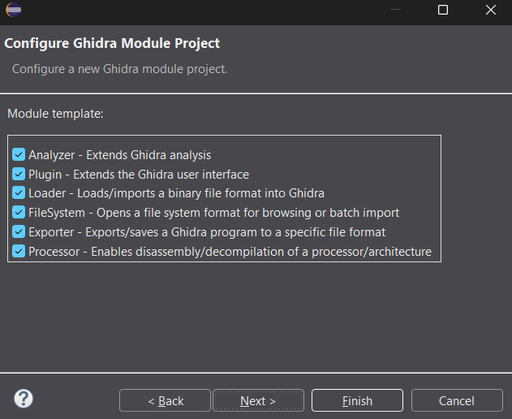

# Ghidra Loader Design Notes

So, we have 3 issues with only using a Ghidra Processor as mentioned in [[Additional Functionality]]:
1. automatically set base address to `0x200` when importing `.ch8` file
2. be able to detect sprites in memory (currently just looks like bytes)
3. be able to automatically load the FONTSET into the memory at `0x000` to `0x050`

Also, apparently when I created the project in Eclipse, I didn't realize it selects this by default:



So really, I am creating a Ghidra Module that so far consists of:
- Ghidra processor (everything in `data/languages/`)
- Ghidra loader (after this is done)

## Issue #1: automatically setting base address to `0x200`
We can actually solve this issue quite easily by just writing a custom loader; the Eclipse project created a Java file that contains everything necessary to create a custom loader.

This essentially consists of a `class` that extends `AbstractProgramWrapperLoader`; i.e. an abstract class that Ghidra source defines for implementing custom loaders; it includes:
- `getName()`: defines the name of the loader (returns a `String`)
- `findSupportedLoadSpecs()`: returns a collection of [LoadSpec](https://ghidra.re/ghidra_docs/api/ghidra/app/util/opinion/LoadSpec.html) objects, which essentially define the possible ways for a loader to load something
- `load()`: performs the actual loading logic; this is where the main body of the loader is
- `getDefaultOptions()` and `validateOptions()` for defining some custom options (which I am not using)

For this issue, all I need is the `findSupportedLoadSpecs()` and `load()` methods;

Typically when writing logic for `findSupportedLoadSpecs()`, you would want to have some sort of byte-matching or something to ensure that what we're looking at is the correct filetype; but since CHIP-8 doesn't have any magic header bytes (e.g. like ELF has `\x7F\x45\x4c\x46`), we can just assume that what we're looking at is a CHIP-8 ROM (as long as it isn't 0 bytes):
```java
@Override
public Collection<LoadSpec> findSupportedLoadSpecs(ByteProvider provider) throws IOException {
	List<LoadSpec> loadSpecs = new ArrayList<>();

	// Assume we are loading a CHIP-8 program if the provider is not empty.
	// In a more complex architecture, we would likely want to check the file type or contents.
	if (provider.length() > 0) {
		loadSpecs.add(new LoadSpec(this, CHIP8_PROGRAM_START_OFFSET, true));
	}

	return loadSpecs;
}
```
- we create a new `LoadSpec` object with:
	- `this` specified as the `Loader` (our class is the loader we are creating)
	- `CHIP8_PROGRAM_START_OFFSET` is a `static long` I created equal to `0x200`
	- `true` for the "`requiresLanguageCompilerSpec`" value; means that it "requires a language/compiler to load" (which in our case is our CHIP-8 language specification)

For the `load()` method, we do a little bit more, but still relatively simple:
```java
@Override
protected void load(ByteProvider provider, LoadSpec loadSpec, List<Option> options,
		Program program, TaskMonitor monitor, MessageLog log)
		throws CancelledException, IOException {
	try {
		// Get the program's memory manager
		Memory memory = program.getMemory();
	
		// Define the starting address for CHIP-8 programs
		Address startAddress = program.getAddressFactory().getDefaultAddressSpace().getAddress(CHIP8_PROGRAM_START_OFFSET);
		// Create a memory block starting at 0x200
		MemoryBlock block = memory.createInitializedBlock(
			"CHIP8_ROM",              // Block name
			startAddress,       // Starting address (0x200)
			provider.getInputStream(0), // Input stream from the file
			provider.length(),  // Size of the file
			monitor,           // Task monitor
			false              // Overlay flag
		);
		
		// Set the memory block properties
		block.setRead(true);
		block.setWrite(true);
		block.setExecute(true);
		
		// Add the entry point at 0x200
		program.getSymbolTable().addExternalEntryPoint(startAddress);
		
		// Optionally, create a label at the entry point
		program.getSymbolTable().createLabel(startAddress, "entry", SourceType.IMPORTED);
		
		log.appendMsg("CHIP-8 program loaded starting at address 0x200");
	} catch (Exception e) {
		log.appendException(e);
		throw new IOException("Failed to load CHIP-8 program", e);
	}
}
```

To break this down:
First, we get the program's memory with:
```java
Memory memory = program.getMemory();
```
and then create an address that represents our `0x200` start address:
```java
Address programStart = program.getAddressFactory().getDefaultAddressSpace().getAddress(CHIP8_PROGRAM_START_OFFSET);
```
(again, `CHIP8_PROGRAM_START_OFFSET` is a `static long` defined in the class)
and then we create a new memory block:
```java
// Create a memory block starting for the CHIP-8 program ROM
MemoryBlock block = memory.createInitializedBlock(
	"CHIP8_ROM",              	// Block name
	programStart,              	// Starting address (0x200)
	provider.getInputStream(0), // Input stream from the file
	provider.length(),  		// Size of the file
	monitor,           			// Task monitor
	false              			// Overlay flag
);

// Set program memory block properties
block.setRead(true);
block.setWrite(true);
block.setExecute(true);
```
and finally set our entry point to our defined address:
```java
// Add the entry point at 0x200
program.getSymbolTable().addExternalEntryPoint(programStart);

// Create a label at the entry point
program.getSymbolTable().createLabel(programStart, "main", SourceType.IMPORTED);
```

The `provider` passed into the method is of type "`ByteProvider`", which is an interface that provides a generic abstraction for reading byte data from various sources; but the `provider` passed into the method is essentially the file

Another thing to note; the memory blocks that we define in our loader are not necessarily conflicting with those defined within `<default_memory_blocks>` in our `pspec`; 
Memory blocks defined in our loader are **complementary** to those in our processor;

One way to look at it is that the Processor defines the "theoretical memory model" that Ghidra uses to understand the architecture,

while the Loader establishes and creates the actual memory blocks that exist when loading a specific binary/program (these are program-specific; again, we would typically have more logic involved in `findSupportedLoadSpecs()`, but since we are only dealing with ROMs - which literally only contain the raw byte instructions - we do not have any such logic)

## Issue #3: loading the FONTSET into memory
Doing #3 first because I think it's a bit easier than #2 with the newfound knowledge we now have about loaders;

In order to load the font set into memory at `0x000`, we can simply define another memory block in our custom loader and hard-code the values into it;

Like earlier, we create an `Address` object to indicate where the memory block should start:
```java
Address fontsetStart = program.getAddressFactory().getDefaultAddressSpace().getAddress(0x000);
```
then create the `MemoryBlock` object:
```java
// Create a memory block for the CHIP-8 font set
MemoryBlock fontsetBlock = memory.createInitializedBlock(
	"CHIP8_FONTSET",
	fontsetStart,
	new ByteArrayInputStream(CHIP8_FONTSET),
	CHIP8_FONTSET.length,
	monitor,
	false
);

// Set properties for the fontset memory block
fontsetBlock.setRead(true);
fontsetBlock.setWrite(false);
fontsetBlock.setExecute(false);
```
`ByteArrayInputStream(CHIP8_FONTSET)` is essentially the data we are using to define the region; we define `CHIP8_FONTSET` as so:
```java
private static final byte[] CHIP8_FONTSET = {
	(byte)0xF0, (byte)0x90, (byte)0x90, (byte)0x90, (byte)0xF0, // 0
	(byte)0x20, (byte)0x60, (byte)0x20, (byte)0x20, (byte)0x70, // 1
	(byte)0xF0, (byte)0x10, (byte)0xF0, (byte)0x80, (byte)0xF0, // 2
	(byte)0xF0, (byte)0x10, (byte)0xF0, (byte)0x10, (byte)0xF0, // 3
	(byte)0x90, (byte)0x90, (byte)0xF0, (byte)0x10, (byte)0x10, // 4
	(byte)0xF0, (byte)0x80, (byte)0xF0, (byte)0x10, (byte)0xF0, // 5
	(byte)0xF0, (byte)0x80, (byte)0xF0, (byte)0x90, (byte)0xF0, // 6
	(byte)0xF0, (byte)0x10, (byte)0x20, (byte)0x40, (byte)0x40, // 7
	(byte)0xF0, (byte)0x90, (byte)0xF0, (byte)0x90, (byte)0xF0, // 8
	(byte)0xF0, (byte)0x90, (byte)0xF0, (byte)0x10, (byte)0xF0, // 9
	(byte)0xF0, (byte)0x90, (byte)0xF0, (byte)0x90, (byte)0x90, // A
	(byte)0xE0, (byte)0x90, (byte)0xE0, (byte)0x90, (byte)0xE0, // B
	(byte)0xF0, (byte)0x80, (byte)0x80, (byte)0x80, (byte)0xF0, // C
	(byte)0xE0, (byte)0x90, (byte)0x90, (byte)0x90, (byte)0xE0, // D
	(byte)0xF0, (byte)0x80, (byte)0xF0, (byte)0x80, (byte)0xF0, // E
	(byte)0xF0, (byte)0x80, (byte)0xF0, (byte)0x80, (byte)0x80  // F
};
```
then we can simply create labels for each 5-byte interval (sprite):
```java
// Create labels for each character in the font set
for (int i = 0; i < CHIP8_FONTSET.length / 5; i++) {
	Address charAddress = fontsetStart.add(i * 5);
	String charLabel = String.format("FONTSET_%X", i);
	program.getSymbolTable().createLabel(charAddress, charLabel, SourceType.IMPORTED);
}
```

This is kind of a "cheesy" solution, because instead of reading from the `provider` object passed into the method (i.e. the file itself), we read from data that we directly define;

## Results
The results of this are that we are now able to simply select our `CHIP8` processor, and our loader will not only automatically set the base address to `0x200`, but also load in our custom FONTSET:


we can also see our log messages when we import a file, showing that our font set and program have been loaded into their respective memory locations.

Now, all we have on our (current) TODO list is to figure out how to show sprites in our analysis